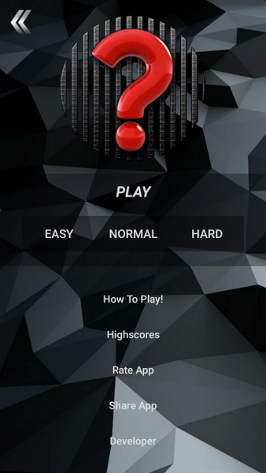
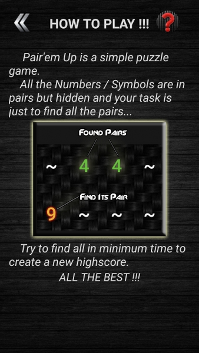
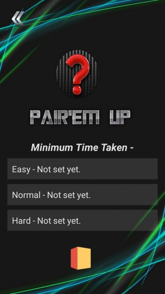

# Pair'em Up - Android Puzzle Game 
 
<a href="https://play.google.com/store/apps/details?id=com.abhishekgupta.pairthemup"></a>

## To use source code : 
1. Clone Repository <br>
```git clone https://github.com/ft-abhishekgupta/android-game-puzzle-pairemup```
1. Open Repository in Android Studio
1. Sync Project and Install Required Dependencies
1. Build and Run Project.

## About App :
Pair'em Up is a matching game where you have to use your memory to quickly find and match all the characters.

Comprises of three levels -
> Easy |
> Normal | 
> Hard

Try solving faster to create a new highscore or beat your own highscores.

Relative positions of characters is changed every time you play!

**Do rate and share if you like the game.**
## Screenshots




